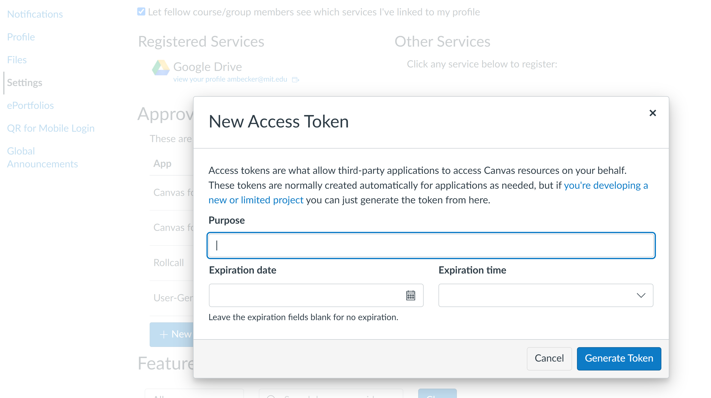

# Canvas File Downloader

Complete file downloader for Canvas (Instructure)!

Originally by [Ben Javicente](https://github.com/benjavicente/canvas-file-downloader), essentially rewritten from scratch by [Aaron Becker](https://github.com/aaroexxt).

Written during senior year at MIT, since I want to save as many files as I can from the classes here (and relive the joy & pain of the last 4 years)

### Features:

- Downloads all courses (or only the ones marked as favorites)
- Can see everything you can see, i.e. every accessible assignment will be downloaded
- Download from Modules, Course Files, Pages or all
- File caching & remote size comparison - will only download missing or incompletely downloaded files
- If a Google Drive file is linked, it will be downloaded
- Semi-extensively tested (lol - fixed a lot of bugs)

## Usage:

### Install required packages

Download all package requirements with:

```shell
python -m pip install -r requirements.txt
```

### Generate canvas API token

In order to access your Canvas account, you need an API token. To do this, go to Canvas -> Profile -> Settings -> Approved Integrations.

Then, click on "New Access Token" and enter "CanvasDownloader" in Purpose, then click Generate. See below:



You will get a token with a form like `7XXX~XXXXXXXXXXXXXXXXXXXXXXXXXXXXXXXX`. Copy this text, that's the actual access key.

### Run the script downloader script

Usage is simple:

```shell
python canvas.py <YOUR-TOKEN> <CANVAS-DOMAIN> --all
```

Where:

- `YOUR-TOKEN` is the token access of Canvas, generated from your settings page, see [above](#generate-canvas-api-token) for instructions (for me, this is `https://canvas.mit.edu/profile/settings`)
- `CANVAS-DOMAIN` the Canvas domain where files will be downloaded.

You should be prompted with a list of available courses to download from, if it's just a few classes make sure you include the `--all` flag to ensure it's all classes and not just favorites.

Example:
```shell
python canvas.py 7XXX~XXXXXXXXXXXXXXXXXXXXXXXXXXXXXXXX canvas.mit.edu --all
```

Optional parameters:

- `-f FROM`: where to download the files, can be modules,
  folders, pages or all (default: `all`).
- `-o DIR`: name of the output directory (default: `CanvasFiles`).
- `--all`: include all courses instead of only favorites.

Related projects:

- [CanvasSync](https://github.com/perslev/CanvasSync)
- [CanvasAPI](https://github.com/ucfopen/canvasapi)
- [Canvas LMS](https://github.com/instructure/canvas-lms)

Enjoy!
